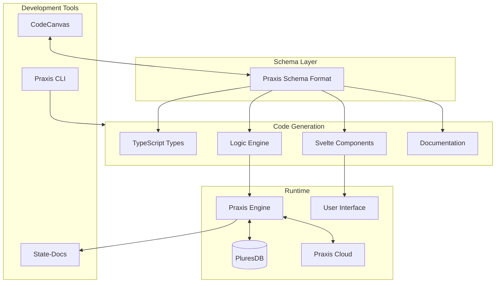

# Praxis Documentation

Welcome to the official Praxis documentation! Praxis is the full-stack application framework for the Plures ecosystem, providing a complete solution for building modern, local-first, distributed applications.

## Quick Start

```bash
# Install Praxis
npm install @plures/praxis

# Create a new app
npx praxis create app my-app
cd my-app
npm install

# Start development
npm run dev
```

## Documentation Index

### Core Concepts

| Document                                               | Description                                  |
| ------------------------------------------------------ | -------------------------------------------- |
| [What is Praxis](./core/what-is-praxis.md)             | Overview of Praxis and its core philosophy   |
| [Schema Model](./core/schema-model.md)                 | Understanding the Praxis Schema Format (PSF) |
| [Logic Engine](./core/logic-engine.md)                 | Facts, events, rules, and constraints        |
| [UI Generation](./core/ui-generation.md)               | Automatic component generation from schemas  |
| [PluresDB Integration](./core/pluresdb-integration.md) | Local-first data with reactive storage       |
| [Code ↔ Canvas Sync](./core/code-canvas-sync.md)      | Bidirectional synchronization                |
| [CLI Usage](./core/cli-usage.md)                       | Command-line interface reference             |
| [Building Extensions](./core/building-extensions.md)   | Extending Praxis functionality               |

### Guides

| Guide                                                         | Description                         |
| ------------------------------------------------------------- | ----------------------------------- |
| [Getting Started](./guides/getting-started.md)                | First steps with Praxis             |
| [Svelte Integration](./guides/svelte-integration.md)          | Using Praxis with Svelte 5          |
| [Canvas](./guides/canvas.md)                                  | Visual development with CodeCanvas  |
| [History & State Patterns](./guides/history-state-pattern.md) | Undo/redo and time-travel debugging |
| [Parallel State Patterns](./guides/parallel-state-pattern.md) | Managing parallel state machines    |
| [Orchestration](./guides/orchestration.md)                    | Distributed system coordination     |

### Tutorials

| Tutorial                                           | Description                      |
| -------------------------------------------------- | -------------------------------- |
| [Build Your First App](./tutorials/first-app.md)   | Step-by-step beginner tutorial   |
| [Todo with PluresDB](./tutorials/todo-pluresdb.md) | Local-first todo application     |
| [Form Builder](./tutorials/form-builder.md)        | Dynamic form creation            |
| [E-commerce Cart](./tutorials/ecommerce-cart.md)   | Shopping cart with checkout flow |

### Examples

| Example                                     | Description                  |
| ------------------------------------------- | ---------------------------- |
| [Hero Shop](../examples/hero-shop/)         | Full e-commerce application  |
| [Todo](../examples/todo/)                   | Minimal todo application     |
| [Form Builder](../examples/form-builder/)   | Dynamic form builder         |
| [Offline Chat](../examples/offline-chat/)   | Local-first chat application |
| [Terminal Node](../examples/terminal-node/) | Self-orchestrating node      |
| [Cloud Sync](../examples/cloud-sync/)       | Multi-client synchronization |

## Architecture Overview



## Key Features

### 🎯 Schema-Driven Development

Define your entire application in PSF (Praxis Schema Format), then generate everything else.

### ⚡ Logic Engine

Pure, functional business logic with facts, events, rules, and constraints.

### 🧩 Component Generation

Automatically generate Svelte components from your schemas.

### 📱 Local-First

Built-in PluresDB integration for offline-capable, reactive data storage.

### 🎨 Visual Development

CodeCanvas provides visual schema and logic editing.

### 📚 Auto-Documentation

State-Docs generates documentation automatically from schemas.

### 🌐 Cross-Platform

Deploy to web, desktop (Tauri), and mobile from a single codebase.

### 🔄 Real-Time Sync

Praxis Cloud provides sync across devices and users.

## Installation Options

### npm

```bash
npm install @plures/praxis
```

### Deno

```typescript
import { createPraxisEngine } from 'jsr:@plures/praxis';
```

### C# (.NET)

```bash
dotnet add package Plures.Praxis
```

## Community

- 💬 [GitHub Discussions](https://github.com/plures/praxis/discussions)
- 🐛 [Issue Tracker](https://github.com/plures/praxis/issues)
- 📖 [Contributing Guide](../CONTRIBUTING.md)
- 🔒 [Security Policy](../SECURITY.md)

## License

Praxis is open source under the [MIT License](../LICENSE).

---

**Next:** [What is Praxis?](./core/what-is-praxis.md)
