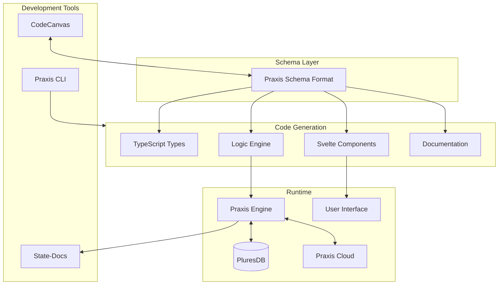

# Praxis 2.0 Documentation

Welcome to the official Praxis documentation. Praxis is the full-stack declarative application framework for the Plures ecosystem — typed logic, reactive state, local-first data, and visual tooling for Svelte, Node, and the browser.

> **New to Praxis?** Start with the [Getting Started guide](../GETTING_STARTED.md).
> **Upgrading from 1.x?** See the [Migration Guide](../MIGRATION_GUIDE.md).

## Quick Start

```bash
npm install @plures/praxis
npx praxis create app my-app
```

## Documentation Index

### Core Concepts

| Document | Description |
|----------|-------------|
| [What is Praxis](./core/what-is-praxis.md) | Overview and philosophy |
| [Praxis-Core API](./core/praxis-core-api.md) | Stable API surface and guarantees |
| [Extending Praxis-Core](./core/extending-praxis-core.md) | Extension guidelines |
| [Schema Model](./core/schema-model.md) | Praxis Schema Format (PSF) |
| [Logic Engine](./core/logic-engine.md) | Facts, events, rules, and constraints |
| [UI Generation](./core/ui-generation.md) | Component generation from schemas |
| [PluresDB Integration](./core/pluresdb-integration.md) | Local-first data with reactive storage |
| [Code ↔ Canvas Sync](./core/code-canvas-sync.md) | Bidirectional synchronization |
| [CLI Usage](./core/cli-usage.md) | Command-line interface reference |
| [Building Extensions](./core/building-extensions.md) | Extending Praxis |

### Guides

| Guide | Description |
|-------|-------------|
| [Getting Started](./guides/getting-started.md) | First steps with Praxis |
| [Svelte Integration](./guides/svelte-integration.md) | Using Praxis with Svelte 5 |
| [Canvas](./guides/canvas.md) | Visual development with CodeCanvas |
| [History & State Patterns](./guides/history-state-pattern.md) | Undo/redo and time-travel debugging |
| [Parallel State Patterns](./guides/parallel-state-pattern.md) | Managing parallel state machines |
| [Orchestration](./guides/orchestration.md) | Distributed system coordination |
| [CI/CD Pipeline](./guides/cicd-pipeline.md) | Continuous integration setup |

### Tutorials

| Tutorial | Description |
|----------|-------------|
| [Build Your First App](./tutorials/first-app.md) | Step-by-step beginner tutorial |
| [Todo with PluresDB](./tutorials/todo-pluresdb.md) | Local-first todo application |
| [Form Builder](./tutorials/form-builder.md) | Dynamic form creation |
| [E-commerce Cart](./tutorials/ecommerce-cart.md) | Shopping cart with checkout flow |

### Decision Ledger

| Resource | Description |
|----------|-------------|
| [Dogfooding Guide](./decision-ledger/DOGFOODING.md) | Decision Ledger workflow |
| [Behavior Ledger](./decision-ledger/BEHAVIOR_LEDGER.md) | Rule/constraint change log |
| [Contract Index](./decision-ledger/contract-index.json) | Machine-readable contract inventory |

### Examples

| Example | Description |
|---------|-------------|
| [Unified App](../examples/unified-app/) | `createApp()` with rules and Mermaid docs |
| [Hero Shop](../examples/hero-shop/) | Full e-commerce application |
| [Todo](../examples/todo/) | Minimal todo application |
| [Form Builder](../examples/form-builder/) | Dynamic form builder |
| [Offline Chat](../examples/offline-chat/) | Local-first chat application |
| [Terminal Node](../examples/terminal-node/) | Command execution with YAML schemas |
| [Cloud Sync](../examples/cloud-sync/) | Multi-client synchronization |
| [Decision Ledger](../examples/decision-ledger/) | Contracts, validation, SARIF output |

## Architecture


```mermaid
flowchart TB
    subgraph Schema["Schema Layer"]
        PSF[Praxis Schema Format]
    end

    subgraph Generation["Code Generation"]
        PSF --> Types[TypeScript Types]
        PSF --> Components[Svelte Components]
        PSF --> Logic[Logic Engine]
        PSF --> Docs[Documentation]
    end

    subgraph Runtime["Runtime"]
        Logic --> Engine[Praxis Engine]
        Components --> UI[User Interface]
        Engine <--> PluresDB[(PluresDB)]
        Engine <--> Cloud[Praxis Cloud]
    end

    subgraph Tools["Development Tools"]
        Canvas[CodeCanvas]
        CLI[Praxis CLI]
        StateDocs[State-Docs]
    end

    Canvas <--> PSF
    CLI --> Generation
    Engine --> StateDocs
```

## Dogfooding

We actively dogfood all Plures tools during development:

- [Dogfooding Index](./DOGFOODING_INDEX.md) — overview
- [Quick Start](./DOGFOODING_QUICK_START.md) — get started in 5 minutes
- [Checklist](./DOGFOODING_CHECKLIST.md) — daily/weekly/monthly workflows
- [Tools Inventory](./PLURES_TOOLS_INVENTORY.md) — all available tools
- [Workflow Example](./examples/DOGFOODING_WORKFLOW_EXAMPLE.md) — see it in action

## 1.x Documentation Archive

Historical documentation from Praxis 1.x development is preserved in [archive/1.x/](./archive/1.x/).

## Community

- 💬 [GitHub Discussions](https://github.com/plures/praxis/discussions)
- 🐛 [Issue Tracker](https://github.com/plures/praxis/issues)
- 📖 [Contributing Guide](../CONTRIBUTING.md)
- 🔒 [Security Policy](../SECURITY.md)

## License

Praxis is open source under the [MIT License](../LICENSE).

---

**Next:** [What is Praxis?](./core/what-is-praxis.md)
