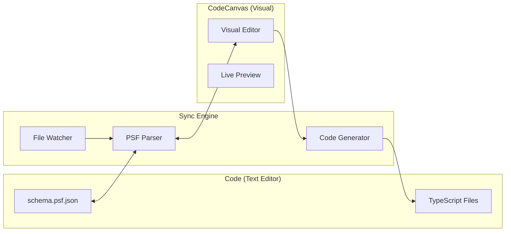

# Code ↔ Canvas Sync

Praxis provides bidirectional synchronization between code (PSF schemas, TypeScript) and CodeCanvas (visual editor). This allows developers to work in their preferred mode while keeping everything in sync.

## Overview



## How It Works

### Code-First Workflow

1. Write or edit `schema.psf.json` in your text editor
2. File watcher detects changes
3. Canvas automatically updates to reflect changes
4. Visual editor shows the new state

### Canvas-First Workflow

1. Design visually in CodeCanvas
2. Canvas generates/updates `schema.psf.json`
3. Run code generation to update TypeScript files
4. Code editor reflects the changes

### Hybrid Workflow

Work in both modes simultaneously:

- Use Canvas for visual design and high-level structure
- Use code editor for detailed logic and fine-tuning
- Changes sync automatically in both directions

## Setting Up Sync

### 1. Start Canvas with Sync

```bash
# Start Canvas with file watching
praxis canvas ./src/schema.psf.json --watch

# With custom config
praxis canvas ./src/schema.psf.json --config canvas.config.ts
```

### 2. Configure Sync Options

Create `canvas.config.ts`:

```typescript
import type { CanvasConfig } from '@plures/praxis/canvas';

export const config: CanvasConfig = {
  sync: {
    // Enable bidirectional sync
    enabled: true,

    // Watch for file changes
    watchFiles: true,

    // Debounce time for file changes (ms)
    debounce: 500,

    // How to handle conflicts
    conflictResolution: 'ask', // 'ask' | 'canvas' | 'code' | 'merge'

    // Auto-regenerate code on Canvas changes
    autoGenerate: true,

    // Files to generate
    generateTargets: ['types', 'components', 'docs'],
  },

  // Code generation settings
  generation: {
    output: './src/generated',
    format: 'typescript',
    formatting: 'prettier',
    includeComments: true,
  },
};
```

## Sync Behaviors

### Real-Time Sync

With `watchFiles: true`, changes sync in real-time:

**Code → Canvas:**

- Edit `schema.psf.json` in VS Code
- Save the file
- Canvas updates within 500ms (configurable debounce)

**Canvas → Code:**

- Make changes in Canvas visual editor
- Click "Save" or auto-save triggers
- `schema.psf.json` updates immediately
- Generated files regenerate (if `autoGenerate: true`)

### Conflict Resolution

When both sides change simultaneously:

#### `'ask'` (Default)

Shows a dialog to choose which version to keep:

```
┌─────────────────────────────────────┐
│  Sync Conflict Detected             │
│                                     │
│  Both code and canvas have changes. │
│                                     │
│  [Use Code] [Use Canvas] [Merge]    │
└─────────────────────────────────────┘
```

#### `'canvas'`

Canvas changes always win:

- Canvas overwrites code changes
- Safe when primarily designing visually

#### `'code'`

Code changes always win:

- Code overwrites Canvas changes
- Safe when primarily coding

#### `'merge'`

Attempts to merge changes:

- Works for independent changes (different models, components)
- Conflicts still require manual resolution

## File Watcher

### CLI Watcher

Use the Praxis CLI for file watching:

```bash
# Watch schema and regenerate on changes
praxis generate --schema ./schema.psf.json --watch

# With specific outputs
praxis generate --schema ./schema.psf.json --watch --only components,types
```

### Programmatic Watcher

```typescript
import { createFileWatcher, regeneratePSF } from '@plures/praxis';

const watcher = createFileWatcher({
  paths: ['./src/schemas/**/*.psf.json'],
  debounce: 500,
  onchange: async (path) => {
    console.log(`Schema changed: ${path}`);
    await regeneratePSF({
      schema: path,
      output: './src/generated',
    });
  },
});

// Start watching
watcher.start();

// Stop watching
watcher.stop();
```

## Canvas API

### Reading Schema State

```typescript
// In Canvas or external tool
import { readPSFSchema, writePSFSchema } from '@plures/praxis';

// Read current schema
const schema = await readPSFSchema('./schema.psf.json');
console.log(schema.models);

// Modify schema
schema.models.push({
  id: 'model_new',
  name: 'NewModel',
  fields: [{ name: 'id', type: 'uuid' }],
});

// Write back
await writePSFSchema('./schema.psf.json', schema);
```

### Canvas Events

```typescript
// Canvas emits events for sync
canvas.on('schema:changed', (schema) => {
  console.log('Schema updated in Canvas');
});

canvas.on('sync:start', () => {
  console.log('Sync starting...');
});

canvas.on('sync:complete', (result) => {
  console.log('Sync complete:', result);
});

canvas.on('sync:conflict', (conflict) => {
  console.log('Conflict:', conflict);
  // Handle conflict programmatically
  conflict.resolve('canvas'); // or 'code' or custom merge
});
```

## PSF Regeneration

When the schema changes, regenerate derived files:

### Automatic Regeneration

```typescript
// canvas.config.ts
export const config: CanvasConfig = {
  sync: {
    autoGenerate: true,
    generateTargets: ['types', 'components', 'docs', 'rules'],
  },
};
```

### Manual Regeneration

```bash
# Regenerate all
praxis generate --schema ./schema.psf.json

# Regenerate specific targets
praxis generate --schema ./schema.psf.json --only types,components
```

### Regeneration API

```typescript
import { generate } from '@plures/praxis/codegen';

await generate({
  schema: './schema.psf.json',
  output: './src/generated',
  targets: ['types', 'components', 'docs'],
  options: {
    formatting: 'prettier',
    includeComments: true,
  },
});
```

## Version Control

### Git Integration

Changes from both code and Canvas are tracked by Git:

```bash
# After making changes in Canvas
git status
#   modified: src/schema.psf.json
#   modified: src/generated/components/NewComponent.svelte

git diff src/schema.psf.json
# Shows the schema changes made in Canvas
```

### Merge Conflicts

When merging branches with schema changes:

1. Git shows conflict in `schema.psf.json`
2. Use Canvas to resolve visually:
   ```bash
   praxis canvas ./schema.psf.json --resolve-conflicts
   ```
3. Or resolve in text editor (JSON merge)
4. Regenerate after resolution:
   ```bash
   praxis generate --schema ./schema.psf.json
   ```

## Best Practices

### 1. Commit Generated Files (Optional)

Choose whether to commit generated files:

**Commit generated files:**

- ✅ Works without build step
- ✅ Code review shows generated changes
- ❌ More merge conflicts

**.gitignore generated files:**

- ✅ Cleaner commits
- ✅ Fewer conflicts
- ❌ Requires build step

### 2. Use Consistent Formatting

Configure Prettier for consistent JSON formatting:

```json
// .prettierrc
{
  "overrides": [
    {
      "files": "*.psf.json",
      "options": {
        "tabWidth": 2,
        "printWidth": 100
      }
    }
  ]
}
```

### 3. Validate Before Commit

Add pre-commit hook:

```bash
# .husky/pre-commit
praxis validate --schema ./src/schema.psf.json
praxis generate --schema ./src/schema.psf.json --check
```

### 4. Document Canvas Usage

Add to your project README:

```markdown
## Development

### Visual Development

\`\`\`bash
praxis canvas ./src/schema.psf.json
\`\`\`

### Code Generation

\`\`\`bash
praxis generate --schema ./src/schema.psf.json
\`\`\`
```

## Troubleshooting

### Sync Not Working

1. **Check Canvas is running:**

   ```bash
   praxis canvas status
   ```

2. **Check file watcher:**

   ```bash
   praxis canvas --debug
   ```

3. **Verify file permissions:**
   Schema file must be writable

### Conflict Loop

If sync keeps creating conflicts:

1. Stop Canvas
2. Resolve manually in code
3. Restart Canvas

### Generated Files Out of Sync

Force regeneration:

```bash
praxis generate --schema ./schema.psf.json --force
```

### Canvas Shows Stale Data

Clear Canvas cache:

```bash
praxis canvas --clear-cache
```

## Advanced: Custom Sync

### Custom Sync Handler

```typescript
import { createSyncHandler } from '@plures/praxis/sync';

const handler = createSyncHandler({
  // Called when code changes
  onCodeChange: async (schema) => {
    // Custom logic before Canvas update
    return schema; // Transformed schema
  },

  // Called when Canvas changes
  onCanvasChange: async (schema) => {
    // Custom logic before code update
    return schema; // Transformed schema
  },

  // Custom conflict resolution
  onConflict: async (local, remote) => {
    // Return merged schema
    return mergeSchemas(local, remote);
  },
});
```

### External Tool Integration

Integrate with other tools:

```typescript
import { createPSFWatcher } from '@plures/praxis';

// Watch for PSF changes from any source
const watcher = createPSFWatcher('./schema.psf.json');

watcher.on('change', async (schema) => {
  // Update external system (e.g., database, API)
  await updateExternalSystem(schema);

  // Notify other tools
  eventBus.emit('schema-updated', schema);
});
```

---

**Next:** [CLI Usage](./cli-usage.md)
