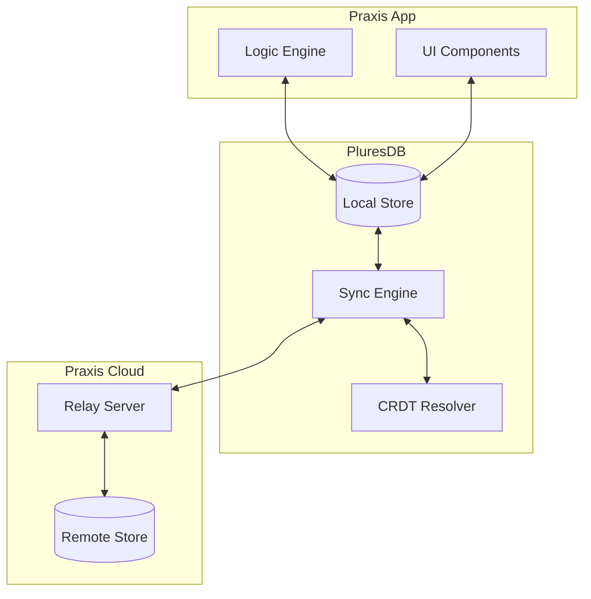

# PluresDB Integration

PluresDB is Praxis's local-first reactive datastore. This document explains how to integrate PluresDB with your Praxis application.

## Overview

PluresDB provides:

- **Local-first storage**: Data lives on the device
- **Reactive queries**: Automatic UI updates on data changes
- **Sync**: Automatic synchronization when connected
- **CRDT-based conflict resolution**: Handle concurrent edits
- **Event sourcing**: Full history of changes



## Setup

### Installation

PluresDB is included with Praxis:

```bash
npm install @plures/praxis
```

### Configuration

Configure PluresDB in your application:

```typescript
import { createPluresDB } from '@plures/praxis';

const db = createPluresDB({
  // Database name (stored in IndexedDB)
  name: 'my-app-db',

  // Schema version (increment to migrate)
  version: 1,

  // Collections to create
  collections: ['users', 'posts', 'comments'],

  // Sync configuration (optional)
  sync: {
    enabled: true,
    endpoint: 'https://your-sync-server.com',
    interval: 5000, // ms
  },
});
```

### From Schema

Generate PluresDB configuration from your PSF schema:

```bash
praxis generate --schema ./schema.psf.json --only pluresdb
```

Generated configuration:

```typescript
// generated/pluresdb-config.ts
import { createPluresDB } from '@plures/praxis';

export const dbConfig = {
  name: 'my-app',
  version: 1,
  collections: [
    {
      name: 'users',
      schema: {
        id: { type: 'uuid', primary: true },
        username: { type: 'string', indexed: true },
        email: { type: 'string', indexed: true, unique: true },
        createdAt: { type: 'datetime' },
      },
    },
    {
      name: 'posts',
      schema: {
        id: { type: 'uuid', primary: true },
        title: { type: 'string' },
        content: { type: 'string' },
        authorId: { type: 'string', ref: 'users' },
      },
    },
  ],
};

export const db = createPluresDB(dbConfig);
```

## CRUD Operations

### Create

```typescript
// Insert a single document
const user = await db.users.insert({
  id: crypto.randomUUID(),
  username: 'alice',
  email: 'alice@example.com',
  createdAt: new Date(),
});

// Insert multiple documents
const users = await db.users.insertMany([
  { id: '1', username: 'bob', email: 'bob@example.com' },
  { id: '2', username: 'carol', email: 'carol@example.com' },
]);
```

### Read

```typescript
// Find by ID
const user = await db.users.findById('user-123');

// Find one by query
const alice = await db.users.findOne({ username: 'alice' });

// Find all matching
const admins = await db.users.find({ role: 'admin' });

// Find with options
const recentUsers = await db.users.find(
  { role: 'user' },
  {
    sort: { createdAt: -1 },
    limit: 10,
    skip: 0,
  }
);
```

### Update

```typescript
// Update by ID
await db.users.updateById('user-123', {
  $set: { username: 'alice2' },
});

// Update matching documents
await db.users.updateMany({ role: 'guest' }, { $set: { active: false } });

// Replace document
await db.users.replaceById('user-123', {
  id: 'user-123',
  username: 'newname',
  email: 'new@example.com',
});
```

### Delete

```typescript
// Delete by ID
await db.users.deleteById('user-123');

// Delete matching documents
await db.users.deleteMany({ active: false });
```

## Reactive Queries

PluresDB queries are reactive - they automatically update when data changes.

### Using Subscriptions

```typescript
// Subscribe to all users
const unsubscribe = db.users.subscribe(
  {}, // Query
  (users) => {
    console.log('Users updated:', users);
  }
);

// Later: unsubscribe
unsubscribe();
```

### With Svelte

```svelte
<script lang="ts">
  import { db } from '../db';

  // Reactive query as a store
  const users = db.users.query({});

  // Derived query
  const activeUsers = db.users.query({ active: true });
</script>

<ul>
  {#each $users as user}
    <li>{user.username}</li>
  {/each}
</ul>
```

### With Praxis Engine

```typescript
import { usePraxisEngine } from '@plures/praxis/svelte';
import { db } from '../db';

// Subscribe to database changes and dispatch engine events
db.users.subscribe({}, (users) => {
  engine.dispatch([UsersUpdated.create({ users })]);
});

// Or integrate directly
const engine = createPraxisEngine({
  initialContext: { users: [] },
  registry,
  plugins: [createPluresDBPlugin(db)],
});
```

## Sync

### Enable Sync

```typescript
const db = createPluresDB({
  name: 'my-app',
  collections: ['users', 'posts'],
  sync: {
    enabled: true,
    endpoint: 'https://your-relay.com',
    authToken: 'user-token',
    autoSync: true,
    syncInterval: 5000,
  },
});
```

### Manual Sync

```typescript
// Trigger sync manually
await db.sync();

// Sync specific collection
await db.users.sync();

// Check sync status
const status = db.getSyncStatus();
console.log(status);
// { lastSync: Date, pending: 5, syncing: false }
```

### Sync Events

```typescript
db.on('sync:start', () => {
  console.log('Sync started');
});

db.on('sync:complete', (result) => {
  console.log('Sync complete:', result);
});

db.on('sync:error', (error) => {
  console.error('Sync error:', error);
});

db.on('sync:conflict', (conflicts) => {
  console.log('Conflicts detected:', conflicts);
});
```

## Conflict Resolution

PluresDB uses CRDTs for conflict-free synchronization.

### Default Strategy: Last-Write-Wins

By default, the most recent change wins:

```typescript
const db = createPluresDB({
  name: 'my-app',
  collections: ['notes'],
  sync: {
    conflictResolution: 'last-write-wins',
  },
});
```

### Custom Resolution

```typescript
const db = createPluresDB({
  name: 'my-app',
  collections: ['notes'],
  sync: {
    conflictResolution: 'custom',
    resolveConflict: (local, remote, base) => {
      // Merge logic
      return {
        ...base,
        ...remote,
        ...local,
        mergedAt: new Date(),
      };
    },
  },
});
```

### Field-Level CRDTs

For fine-grained merging:

```typescript
const db = createPluresDB({
  collections: [
    {
      name: 'documents',
      schema: {
        id: { type: 'uuid' },
        title: { type: 'string', crdt: 'lww' }, // Last-write-wins
        content: { type: 'string', crdt: 'rga' }, // Sequence CRDT
        tags: { type: 'array', crdt: 'or-set' }, // Add-wins set
        viewCount: { type: 'number', crdt: 'counter' }, // Counter
      },
    },
  ],
});
```

## Offline Support

PluresDB works offline by default:

### Checking Connection

```typescript
// Check if online
const isOnline = db.isOnline();

// Subscribe to connection changes
db.on('online', () => console.log('Back online!'));
db.on('offline', () => console.log('Gone offline'));
```

### Pending Changes

```typescript
// Get pending changes (not yet synced)
const pending = await db.getPendingChanges();
console.log(`${pending.length} changes waiting to sync`);

// Clear pending (discard local changes)
await db.clearPending();
```

### Offline Queue

Operations are queued when offline:

```typescript
// Works even when offline
await db.users.insert({ id: '1', name: 'Alice' });

// Check queue
const queue = db.getQueue();
console.log(`${queue.length} operations queued`);

// Queue syncs automatically when back online
```

## Indexing

### Define Indexes

```typescript
const db = createPluresDB({
  collections: [
    {
      name: 'posts',
      schema: {
        id: { type: 'uuid', primary: true },
        title: { type: 'string' },
        authorId: { type: 'string' },
        createdAt: { type: 'datetime' },
        tags: { type: 'array' },
      },
      indexes: [
        { fields: ['authorId'] },
        { fields: ['createdAt'], sort: 'desc' },
        { fields: ['authorId', 'createdAt'], unique: false },
        { fields: ['tags'], type: 'multikey' },
      ],
    },
  ],
});
```

### Query with Indexes

```typescript
// Uses authorId index
const posts = await db.posts.find({ authorId: 'user-123' });

// Uses compound index
const recentPosts = await db.posts.find({ authorId: 'user-123' }, { sort: { createdAt: -1 } });

// Uses multikey index for array
const taggedPosts = await db.posts.find({ tags: 'javascript' });
```

## Relationships

### Define Relationships

From your PSF schema:

```json
{
  "models": [
    {
      "name": "Post",
      "fields": [{ "name": "authorId", "type": "string" }],
      "relationships": [
        {
          "name": "author",
          "type": "many-to-one",
          "target": "User",
          "foreignKey": "authorId"
        }
      ]
    }
  ]
}
```

### Query with Relationships

```typescript
// Include related documents
const posts = await db.posts.find({}, { include: ['author'] });

// Each post has author populated
posts.forEach((post) => {
  console.log(`${post.title} by ${post.author.username}`);
});

// Nested includes
const posts = await db.posts.find({}, { include: ['author', 'comments.author'] });
```

## Integration with Logic Engine

### Event Sourcing

Use PluresDB to persist facts:

```typescript
import { createPraxisEngine } from '@plures/praxis';
import { db } from './db';

const engine = createPraxisEngine({
  initialContext: { ... },
  registry,
  plugins: [
    // Persist facts to PluresDB
    {
      afterStep: async (result) => {
        for (const fact of result.state.facts) {
          await db.facts.insert({
            id: crypto.randomUUID(),
            tag: fact.tag,
            payload: fact.payload,
            timestamp: Date.now(),
          });
        }
      },
    },
  ],
});

// Replay facts to restore state
async function restoreState() {
  const facts = await db.facts.find({}, { sort: { timestamp: 1 } });
  for (const fact of facts) {
    engine.dispatch([fact]);
  }
}
```

### Reactive Context

Sync engine context with database:

```typescript
// Update context when database changes
db.users.subscribe({}, (users) => {
  engine.dispatch([UsersLoaded.create({ users })]);
});

// Persist context changes
engine.subscribe((state) => {
  // Persist to database
  db.state.replaceById('current', {
    id: 'current',
    context: state.context,
    timestamp: Date.now(),
  });
});
```

## Migrations

### Schema Migrations

```typescript
const db = createPluresDB({
  name: 'my-app',
  version: 2, // Increment version
  collections: ['users', 'posts'],
  migrations: [
    {
      version: 2,
      up: async (db) => {
        // Add new field to existing documents
        const users = await db.users.find({});
        for (const user of users) {
          if (!user.role) {
            await db.users.updateById(user.id, {
              $set: { role: 'user' },
            });
          }
        }
      },
      down: async (db) => {
        // Rollback migration
        await db.users.updateMany(
          {},
          {
            $unset: { role: true },
          }
        );
      },
    },
  ],
});
```

## Best Practices

### 1. Define Clear Schemas

```typescript
const db = createPluresDB({
  collections: [
    {
      name: 'users',
      schema: {
        id: { type: 'uuid', primary: true },
        username: { type: 'string', required: true },
        email: { type: 'string', required: true, unique: true },
      },
      validate: true, // Enable validation
    },
  ],
});
```

### 2. Use Transactions

```typescript
await db.transaction(async (tx) => {
  const user = await tx.users.insert({ ... });
  await tx.profiles.insert({ userId: user.id, ... });
  // Both succeed or both fail
});
```

### 3. Handle Errors

```typescript
try {
  await db.users.insert({ ... });
} catch (error) {
  if (error.code === 'UNIQUE_CONSTRAINT') {
    console.log('Email already exists');
  } else if (error.code === 'VALIDATION_ERROR') {
    console.log('Invalid data:', error.details);
  }
}
```

### 4. Clean Up

```typescript
// Close database when done
await db.close();

// Clear all data (development)
await db.clear();
```

---

**Next:** [Code ↔ Canvas Sync](./code-canvas-sync.md)
