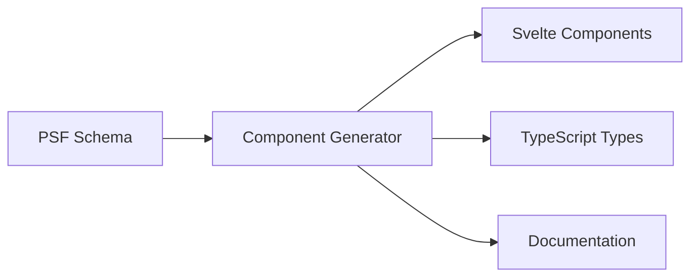

# UI Generation

Praxis automatically generates Svelte components from your schema definitions. This document explains how component generation works and how to customize the output.

## Overview

From a single schema definition, Praxis generates:

- Svelte 5 components with runes
- TypeScript type definitions
- Data binding and validation
- Event handlers
- Documentation



## Component Types

### Form Components

Forms are generated from model definitions:

**Schema:**

```json
{
  "components": [
    {
      "id": "comp_user_form",
      "name": "UserForm",
      "type": "form",
      "model": "User",
      "description": "Form for creating users"
    }
  ]
}
```

**Generated Component:**

```svelte
<script lang="ts">
  import type { User } from '../models';

  interface Props {
    user?: User;
    onsubmit?: (user: User) => void;
    oncancel?: () => void;
  }

  let { user = $bindable(), onsubmit, oncancel }: Props = $props();

  let formData = $state({
    username: user?.username ?? '',
    email: user?.email ?? '',
    role: user?.role ?? 'user',
  });

  let errors = $state<Record<string, string>>({});

  function validate(): boolean {
    errors = {};
    if (!formData.username) errors.username = 'Username is required';
    if (!formData.email) errors.email = 'Email is required';
    return Object.keys(errors).length === 0;
  }

  function handleSubmit(e: Event) {
    e.preventDefault();
    if (validate()) {
      onsubmit?.(formData as User);
    }
  }
</script>

<form onsubmit={handleSubmit}>
  <div class="field">
    <label for="username">Username</label>
    <input id="username" bind:value={formData.username} />
    {#if errors.username}<span class="error">{errors.username}</span>{/if}
  </div>

  <div class="field">
    <label for="email">Email</label>
    <input id="email" type="email" bind:value={formData.email} />
    {#if errors.email}<span class="error">{errors.email}</span>{/if}
  </div>

  <div class="field">
    <label for="role">Role</label>
    <select id="role" bind:value={formData.role}>
      <option value="admin">Admin</option>
      <option value="user">User</option>
      <option value="guest">Guest</option>
    </select>
  </div>

  <div class="actions">
    <button type="submit">Save</button>
    <button type="button" onclick={oncancel}>Cancel</button>
  </div>
</form>
```

### Display Components

Display components show data in read-only format:

**Schema:**

```json
{
  "components": [
    {
      "id": "comp_user_card",
      "name": "UserCard",
      "type": "display",
      "model": "User",
      "description": "Displays user information"
    }
  ]
}
```

**Generated Component:**

```svelte
<script lang="ts">
  import type { User } from '../models';

  interface Props {
    user: User;
    onclick?: (user: User) => void;
  }

  let { user, onclick }: Props = $props();
</script>

<div class="user-card" onclick={() => onclick?.(user)}>
  <h3>{user.username}</h3>
  <p class="email">{user.email}</p>
  <span class="role">{user.role}</span>
</div>
```

### List Components

List components display collections:

**Schema:**

```json
{
  "components": [
    {
      "id": "comp_user_list",
      "name": "UserList",
      "type": "list",
      "model": "User",
      "props": [
        { "name": "users", "type": "User[]", "required": true },
        { "name": "filter", "type": "string", "required": false }
      ]
    }
  ]
}
```

**Generated Component:**

```svelte
<script lang="ts">
  import type { User } from '../models';
  import UserCard from './UserCard.svelte';

  interface Props {
    users: User[];
    filter?: string;
    onselect?: (user: User) => void;
  }

  let { users, filter = '', onselect }: Props = $props();

  let filtered = $derived(
    filter
      ? users.filter(u => u.username.includes(filter))
      : users
  );
</script>

<div class="user-list">
  {#each filtered as user (user.id)}
    <UserCard {user} onclick={onselect} />
  {/each}

  {#if filtered.length === 0}
    <p class="empty">No users found</p>
  {/if}
</div>
```

### Editor Components

Editor components provide rich editing capabilities:

**Schema:**

```json
{
  "components": [
    {
      "id": "comp_form_builder",
      "name": "FormBuilder",
      "type": "editor",
      "description": "Visual form builder"
    }
  ]
}
```

## Customizing Components

### Custom Props

Define custom props in the schema:

```json
{
  "components": [
    {
      "id": "comp_product_card",
      "name": "ProductCard",
      "type": "display",
      "model": "Product",
      "props": [
        { "name": "product", "type": "Product", "required": true },
        { "name": "showPrice", "type": "boolean", "default": true },
        { "name": "currency", "type": "string", "default": "USD" }
      ]
    }
  ]
}
```

### Custom Events

Define events the component emits:

```json
{
  "components": [
    {
      "id": "comp_cart_item",
      "name": "CartItem",
      "type": "display",
      "props": [{ "name": "item", "type": "CartItem", "required": true }],
      "events": [
        { "name": "remove", "payload": "{ itemId: string }" },
        { "name": "updateQuantity", "payload": "{ itemId: string; quantity: number }" }
      ]
    }
  ]
}
```

### Extending Generated Components

Generated components can be extended without modifying them:

```svelte
<!-- CustomProductCard.svelte -->
<script lang="ts">
  import ProductCard from './generated/ProductCard.svelte';
  import type { Product } from './generated/models';

  interface Props {
    product: Product;
  }

  let { product }: Props = $props();
</script>

<div class="custom-wrapper">
  <ProductCard {product} showPrice={true} currency="EUR" />
  <div class="custom-badge">New!</div>
</div>
```

## Field Type Mapping

Praxis maps schema field types to HTML input types:

| Schema Type        | HTML Input                      | Component      |
| ------------------ | ------------------------------- | -------------- |
| `string`           | `<input type="text">`           | Text input     |
| `number`           | `<input type="number">`         | Number input   |
| `boolean`          | `<input type="checkbox">`       | Checkbox       |
| `datetime`         | `<input type="datetime-local">` | Date picker    |
| `{ enum: [...] }`  | `<select>`                      | Dropdown       |
| `{ array: {...} }` | Custom                          | Array editor   |
| `object`           | Nested form                     | Fieldset       |
| `uuid`             | Hidden                          | Auto-generated |

## Validation

Generated forms include validation based on field definitions:

**Schema:**

```json
{
  "models": [
    {
      "name": "User",
      "fields": [
        { "name": "email", "type": "string", "validation": { "format": "email" } },
        { "name": "age", "type": "number", "validation": { "min": 0, "max": 150 } },
        { "name": "username", "type": "string", "validation": { "minLength": 3, "maxLength": 20 } }
      ]
    }
  ]
}
```

**Generated Validation:**

```svelte
<script lang="ts">
  function validate(): boolean {
    errors = {};

    if (!isValidEmail(formData.email)) {
      errors.email = 'Invalid email format';
    }

    if (formData.age < 0 || formData.age > 150) {
      errors.age = 'Age must be between 0 and 150';
    }

    if (formData.username.length < 3) {
      errors.username = 'Username must be at least 3 characters';
    }

    if (formData.username.length > 20) {
      errors.username = 'Username must be at most 20 characters';
    }

    return Object.keys(errors).length === 0;
  }
</script>
```

## Svelte 5 Runes

Generated components use Svelte 5 runes for reactivity:

### $props

Component props use the `$props` rune:

```svelte
<script lang="ts">
  interface Props {
    user: User;
    editable?: boolean;
  }

  let { user, editable = false }: Props = $props();
</script>
```

### $state

Local state uses the `$state` rune:

```svelte
<script lang="ts">
  let formData = $state({
    name: '',
    email: ''
  });

  let errors = $state<Record<string, string>>({});
</script>
```

### $derived

Computed values use the `$derived` rune:

```svelte
<script lang="ts">
  let filteredItems = $derived(
    items.filter(item => item.name.includes(searchTerm))
  );

  let total = $derived(
    items.reduce((sum, item) => sum + item.price, 0)
  );
</script>
```

### $bindable

Two-way binding uses `$bindable`:

```svelte
<script lang="ts">
  interface Props {
    value?: string;
  }

  let { value = $bindable('') }: Props = $props();
</script>

<input bind:value />
```

## Integration with Logic Engine

Generated components integrate with the Praxis engine:

```svelte
<script lang="ts">
  import { usePraxisEngine } from '@plures/praxis/svelte';
  import { engine } from '../engine';
  import { AddToCart, RemoveFromCart } from '../generated/events';

  const { context, dispatch } = usePraxisEngine(engine);

  function handleAddToCart(productId: string) {
    dispatch([AddToCart.create({ productId, quantity: 1 })]);
  }

  function handleRemoveFromCart(itemId: string) {
    dispatch([RemoveFromCart.create({ itemId })]);
  }
</script>

<ProductList
  products={context.products}
  onaddtocart={handleAddToCart}
/>

<ShoppingCart
  items={context.cart.items}
  onremove={handleRemoveFromCart}
/>
```

## Styling

### Default Styles

Generated components include minimal default styles:

```svelte
<style>
  .field {
    margin-bottom: 1rem;
  }

  label {
    display: block;
    margin-bottom: 0.25rem;
  }

  input, select, textarea {
    width: 100%;
    padding: 0.5rem;
    border: 1px solid #ccc;
    border-radius: 4px;
  }

  .error {
    color: red;
    font-size: 0.875rem;
  }
</style>
```

### Custom Styling

Override styles by:

1. **Component-level styles**: Add to wrapper component
2. **Global CSS**: Import a stylesheet
3. **CSS variables**: Use CSS custom properties
4. **Tailwind/UnoCSS**: Configure utility classes

## Generation Commands

### Generate All Components

```bash
praxis generate --schema ./schema.psf.json --output ./generated
```

### Generate Specific Components

```bash
praxis generate --schema ./schema.psf.json --only components --output ./generated/components
```

### Watch Mode

```bash
praxis generate --schema ./schema.psf.json --watch
```

### Custom Templates

Use custom templates for generation:

```bash
praxis generate --schema ./schema.psf.json --templates ./my-templates
```

## Best Practices

### 1. Keep Components Focused

Each component should have a single responsibility:

```json
{
  "components": [
    { "name": "UserAvatar", "type": "display" },
    { "name": "UserName", "type": "display" },
    { "name": "UserCard", "type": "composite" }
  ]
}
```

### 2. Use Model References

Reference models for type safety:

```json
{
  "components": [
    {
      "name": "UserForm",
      "type": "form",
      "model": "User"
    }
  ]
}
```

### 3. Define Clear Events

Document what each event represents:

```json
{
  "events": [
    {
      "name": "submit",
      "payload": "User",
      "description": "Emitted when form is submitted with valid data"
    }
  ]
}
```

### 4. Preserve Customizations

Extend generated components instead of modifying them:

```
components/
├── generated/           # Auto-generated (don't edit)
│   ├── UserForm.svelte
│   └── UserList.svelte
├── UserForm.svelte      # Your customizations
└── UserList.svelte
```

---

**Next:** [PluresDB Integration](./pluresdb-integration.md)
