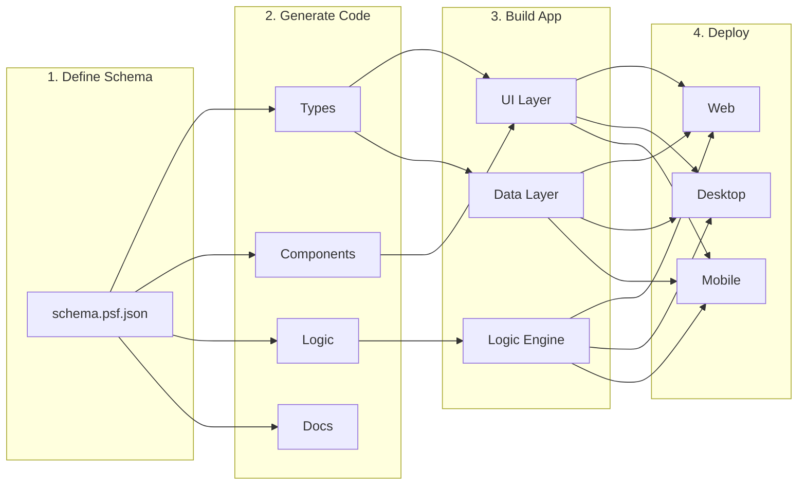

# What is Praxis?

Praxis is a **schema-driven application framework** that unifies data modeling, business logic, UI generation, and documentation into a single coherent system. It's designed for building modern, local-first, distributed applications.

## Core Philosophy

### 1. Schema as Single Source of Truth

In Praxis, everything starts with a schema. The **Praxis Schema Format (PSF)** defines your:

- Data models and relationships
- Business logic (facts, events, rules, constraints)
- UI components and their behavior
- API endpoints and integrations
- Documentation and diagrams

From this single schema, Praxis generates:

- TypeScript types and interfaces
- Svelte UI components
- Database schemas for PluresDB
- API routes and handlers
- Markdown documentation with Mermaid diagrams

### 2. Pure, Functional Logic

The Praxis logic engine is built on pure functions:

- **Facts**: Typed propositions about your domain ("User is logged in", "Cart contains 3 items")
- **Events**: Things that happen ("User clicked login", "Item added to cart")
- **Rules**: Pure functions that derive facts from events
- **Constraints**: Invariants that must always hold

This makes your application logic:

- Predictable and testable
- Serializable (JSON-friendly for cross-language support)
- Easy to reason about and debug

### 3. Local-First by Default

Praxis applications work offline first:

- Data stored locally in PluresDB
- Changes sync when connected
- Conflict resolution built-in
- Users maintain ownership of their data

### 4. Visual and Code Workflows

Praxis supports both visual and code-based development:

- **CodeCanvas**: Visual schema and logic editor
- **Code-first**: Write TypeScript schemas directly
- **Bidirectional sync**: Changes in either flow back to the other

## How It Works



## Example: Simple Counter

### 1. Define the Schema

```json
{
  "$version": "1.0.0",
  "id": "counter-app",
  "name": "Counter",
  "facts": [
    {
      "id": "fact_incremented",
      "tag": "Incremented",
      "description": "Counter was incremented",
      "payload": { "type": "object", "properties": { "value": { "type": "number" } } }
    }
  ],
  "events": [
    {
      "id": "event_increment",
      "tag": "Increment",
      "description": "Increment the counter",
      "payload": { "type": "object", "properties": {} }
    }
  ],
  "rules": [
    {
      "id": "counter.increment",
      "name": "Increment Counter",
      "triggers": ["Increment"],
      "then": {
        "inline": "return [{ tag: 'Incremented', payload: { value: state.context.count + 1 } }];",
        "language": "typescript"
      }
    }
  ]
}
```

### 2. Use the Generated Code

```typescript
import { createPraxisEngine, PraxisRegistry } from '@plures/praxis';

// Types and events are generated from schema
import { Increment, Incremented } from './generated/events';
import { incrementRule } from './generated/rules';

const registry = new PraxisRegistry();
registry.registerRule(incrementRule);

const engine = createPraxisEngine({
  initialContext: { count: 0 },
  registry,
});

// Dispatch events
engine.dispatch([Increment.create({})]);
console.log(engine.getContext()); // { count: 1 }
```

## Key Components

### Praxis Schema Format (PSF)

The JSON/AST format that defines your application:

- Version-controlled and diff-friendly
- Human-readable and machine-parseable
- Supports composition and inheritance
- Extensible with custom metadata

### Logic Engine

The pure functional core:

- Processes events to produce facts
- Maintains immutable state
- Supports undo/redo and time-travel
- Cross-language compatible (TypeScript, C#, PowerShell)

### Component Factory

Generates Svelte components:

- Form components with validation
- List and display components
- Navigation components
- Canvas-compatible output

### PluresDB Integration

Local-first data layer:

- Reactive queries and subscriptions
- Automatic sync with conflict resolution
- Event sourcing support
- Works offline

### CodeCanvas

Visual development environment:

- Drag-and-drop schema design
- Logic flow visualization
- Live component preview
- Two-way sync with code

## Use Cases

### Web Applications

Build modern single-page applications with reactive data and offline support.

### Desktop Applications

Use Tauri to create cross-platform desktop apps from the same codebase.

### Mobile Applications

Deploy to mobile with Svelte Native or Tauri Mobile.

### Distributed Systems

Coordinate multiple nodes with built-in DSC/MCP orchestration.

### Knowledge Management

Create interconnected data systems with PluresDB relationships.

## Comparison

| Feature        | Praxis | Traditional MVC | Redux | XState |
| -------------- | ------ | --------------- | ----- | ------ |
| Schema-driven  | ✅     | ❌              | ❌    | ❌     |
| Logic engine   | ✅     | ❌              | ✅    | ✅     |
| UI generation  | ✅     | ❌              | ❌    | ❌     |
| Local-first    | ✅     | ❌              | ❌    | ❌     |
| Visual editor  | ✅     | ❌              | ❌    | ✅     |
| Cross-language | ✅     | ❌              | ❌    | ❌     |
| Auto-docs      | ✅     | ❌              | ❌    | ❌     |

## Getting Started

Ready to build with Praxis? Check out:

- [Getting Started Guide](../guides/getting-started.md)
- [Schema Model](./schema-model.md)
- [Example Applications](../../examples/)

---

**Next:** [Schema Model](./schema-model.md)
