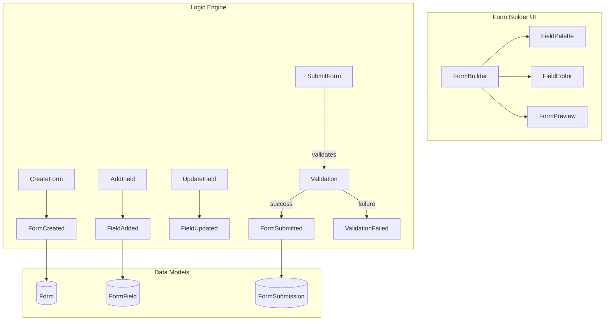

# Form Builder Example

A dynamic form builder application demonstrating Praxis schema composition and component generation.

## Overview

Form Builder showcases advanced Praxis 1.0 features including:

- Schema-driven form definition
- Dynamic component generation
- Field validation and constraints
- Form submission handling
- Data export capabilities

## Features

- **Form Creation**: Create new forms with custom configurations
- **Field Types**: Support for text, number, email, select, checkbox, radio, textarea, date, and file fields
- **Field Configuration**: Set labels, placeholders, validation rules, and required status
- **Drag & Drop**: Reorder fields with drag-and-drop (when generated)
- **Live Preview**: Preview forms as end-users would see them
- **Validation**: Client-side and server-side validation
- **Submissions**: View and export form submissions

## Schema Structure

The schema defines:

### Facts

- `FormCreated`: A new form was created
- `FieldAdded`: A field was added to a form
- `FieldRemoved`: A field was removed from a form
- `FieldUpdated`: A field configuration was updated
- `FormSubmitted`: A form was submitted with data
- `ValidationFailed`: Form validation failed

### Events

- `CreateForm`: Create a new form
- `AddField`: Add a field to the form
- `RemoveField`: Remove a field from the form
- `UpdateField`: Update field configuration
- `ReorderFields`: Change the order of fields
- `SubmitForm`: Submit form data

### Models

- `Form`: Form definition with name and fields
- `FormField`: Field configuration with type, label, validation
- `FormSubmission`: Submitted form data

### Components

- `FormBuilder`: Main builder interface
- `FieldPalette`: Available field types
- `FieldEditor`: Field configuration editor
- `FormPreview`: Live form preview
- `FormRenderer`: End-user form renderer
- `SubmissionsList`: Form submissions list

## Getting Started

```bash
# Install dependencies
npm install

# Generate code from schema
praxis generate --schema ./schema.psf.json --output ./generated

# Start development server
praxis dev
```

## Generated Code

Running `praxis generate` creates:

```
generated/
├── facts.ts           # Fact definitions
├── events.ts          # Event definitions
├── rules.ts           # Rule implementations
├── constraints.ts     # Constraint validators
├── models.ts          # TypeScript interfaces
├── components/
│   ├── FormBuilder.svelte
│   ├── FieldPalette.svelte
│   ├── FieldEditor.svelte
│   ├── FormPreview.svelte
│   ├── FormRenderer.svelte
│   └── SubmissionsList.svelte
└── docs/
    └── README.md      # Generated documentation
```

## Usage Example

```typescript
import { createPraxisEngine } from '@plures/praxis';
import { rules, constraints } from './generated';

// Create engine
const engine = createPraxisEngine({
  initialContext: { forms: [], submissions: [] },
  registry: rules,
});

// Create a new form
engine.dispatch({
  tag: 'CreateForm',
  payload: { name: 'Contact Form', description: 'Customer contact form' },
});

// Add fields
engine.dispatch({
  tag: 'AddField',
  payload: {
    formId: 'form-id',
    fieldType: 'text',
    label: 'Full Name',
    required: true,
  },
});

engine.dispatch({
  tag: 'AddField',
  payload: {
    formId: 'form-id',
    fieldType: 'email',
    label: 'Email Address',
    required: true,
  },
});

// Submit form data
engine.dispatch({
  tag: 'SubmitForm',
  payload: {
    formId: 'form-id',
    data: {
      'field-1': 'John Doe',
      'field-2': 'john@example.com',
    },
  },
});
```

## Architecture



## Field Types

| Type       | Description            | Options                       |
| ---------- | ---------------------- | ----------------------------- |
| `text`     | Single-line text input | maxLength, minLength, pattern |
| `number`   | Numeric input          | min, max, step                |
| `email`    | Email address input    | Built-in email validation     |
| `select`   | Dropdown selection     | options array                 |
| `checkbox` | Boolean checkbox       | -                             |
| `radio`    | Radio button group     | options array                 |
| `textarea` | Multi-line text        | rows, maxLength               |
| `date`     | Date picker            | min, max                      |
| `file`     | File upload            | accept, maxSize               |

## Validation Rules

Fields can have validation rules:

```json
{
  "validation": {
    "minLength": 2,
    "maxLength": 100,
    "pattern": "^[A-Za-z ]+$",
    "customMessage": "Please enter a valid name"
  }
}
```

## Constraints

The schema enforces:

- **Unique Field IDs**: All field IDs within a form must be unique
- **Maximum Fields**: A form cannot have more than 50 fields

## Best Practices

1. **Use Descriptive Labels**: Help users understand what each field requires
2. **Set Sensible Defaults**: Provide placeholder text and default values
3. **Validate Early**: Use client-side validation for immediate feedback
4. **Group Related Fields**: Use field ordering to group related information
5. **Test with Preview**: Always preview forms before publishing

## PluresDB Integration

Forms and submissions can be persisted with PluresDB:

```typescript
import { createPluresDB } from '@plures/pluresdb';
import { Form, FormSubmission } from './generated/models';

const db = createPluresDB({
  collections: [Form, FormSubmission],
  sync: {
    enabled: true,
    endpoint: 'https://your-sync-endpoint.com',
  },
});
```

## License

MIT
