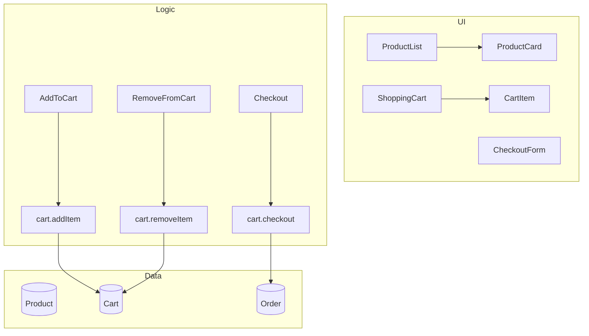

# Hero Shop Example

A sample e-commerce application demonstrating Praxis 1.0 features.

## Overview

Hero Shop showcases the schema-driven approach to application development with Praxis. The entire application is defined in `schema.psf.json`, from which all code, components, and documentation are generated.

## Features

- **Product Catalog**: Browse products by category
- **Shopping Cart**: Add, remove, and update cart items
- **Checkout Flow**: Complete multi-step checkout process
- **Order Management**: Track order status

## Schema Structure

The schema defines:

- **Facts**: `CartItemAdded`, `CartItemRemoved`, `OrderPlaced`
- **Events**: `AddToCart`, `RemoveFromCart`, `Checkout`, `UpdateQuantity`
- **Rules**: Business logic for cart operations and checkout
- **Constraints**: Validation rules for cart items
- **Models**: `Product`, `CartItem`, `Order`
- **Components**: `ProductCard`, `ProductList`, `ShoppingCart`, `CheckoutForm`
- **Flows**: `CheckoutFlow` for the multi-step checkout process

## Getting Started

```bash
# Install dependencies
npm install

# Generate code from schema
praxis generate --schema ./schema.psf.json --output ./generated

# Start development server
praxis dev
```

## Generated Code

Running `praxis generate` will create:

- `generated/facts.ts` - Fact definitions
- `generated/events.ts` - Event definitions
- `generated/rules.ts` - Rule implementations
- `generated/constraints.ts` - Constraint validators
- `generated/models.ts` - TypeScript interfaces
- `generated/components/` - Svelte components
- `generated/docs/` - Markdown documentation

## Architecture



## License

MIT
